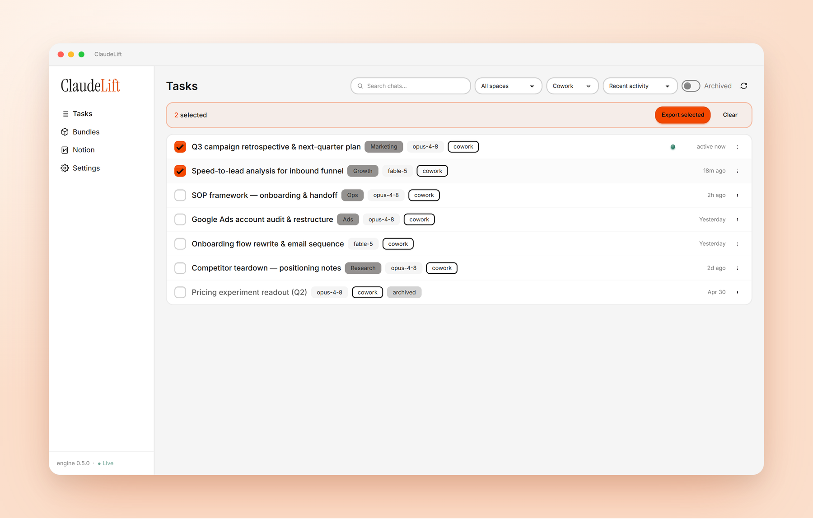
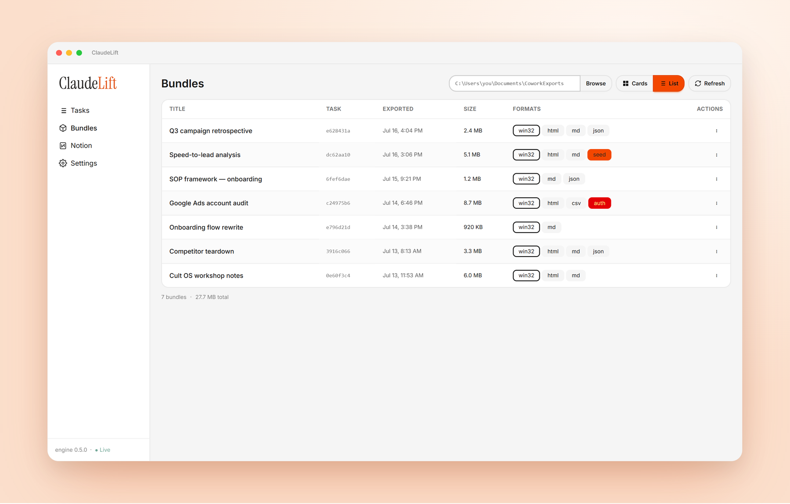

# ClaudeLift

> Export, archive, migrate, and resume your **Claude Cowork** chats — a fast, signed Windows desktop app.

<p align="center">
  <a href="https://github.com/gfsaaser24/ClaudeLift/releases/latest"></a>
  
  <a href="LICENSE"></a>
  
  <a href="https://claudelift.app"></a>
</p>

<p align="center">
  
</p>

<p align="center">
  <a href="https://github.com/gfsaaser24/ClaudeLift/releases/latest"><b>⬇&nbsp;&nbsp;Download for Windows</b></a>
  &nbsp;&nbsp;·&nbsp;&nbsp;
  <a href="#-build-from-source">Build from source</a>
  &nbsp;&nbsp;·&nbsp;&nbsp;
  <a href="#-features">Features</a>
</p>

## 🎬 70-second demo

https://github.com/gfsaaser24/ClaudeLift/raw/main/docs/media/claudeliftlaunch.mp4

**ClaudeLift** is a Windows desktop app for taking control of your **Claude Cowork** chats. Cowork is the agent-chat feature inside Anthropic's Claude Desktop app, where each conversation ("task") runs in its own sandboxed working directory with uploads, generated outputs, an audit log, and every file the assistant wrote or edited. ClaudeLift reads all of that straight off disk and turns each chat into a self-contained, portable bundle — rendered transcripts (HTML, Markdown, JSON, CSV) alongside the chat's real files.

No Python, no command line, nothing to install first. ClaudeLift ships a bundled engine as a sidecar executable, so you download one installer and go. Under a clean daisyUI "wireframe" orange theme, it gives you a live view of every Cowork chat, one-click (or batch) export, an in-app bundle browser, Notion publishing, and a system-tray presence that stays out of your way.

---

## Table of contents

- [Features](#-features)
- [Screenshots](#-screenshots)
- [MCP server](#-mcp-server)
- [Install](#-install)
- [Build from source](#-build-from-source)
- [Tech stack](#-tech-stack)
- [License](#-license)

---

## Features

| Area | What you get |
|---|---|
| **Tasks view** | A live, searchable list of every Cowork chat, with batch export. |
| **Export** | One-click or multi-select export to a portable bundle in the formats you choose. |
| **Bundles view** | Browse, preview, re-seed, and re-import your exported bundles. |
| **Notion export** | Push any bundle into a Notion database, one page per chat. |
| **MCP server** | Let Claude Desktop, Claude Code, or Cursor read and export your chats over MCP. |
| **System tray** | Minimize- or close-to-tray, single instance, quick actions. |
| **Stateful & light** | Settings, window, and connections persist; transcripts load lazily. |

### 📋 Tasks view

- Live list of every Cowork chat, with **search**, **filter** by space or source, **sort**, and a **show-archived** toggle.
- **Multi-select batch export** — pick any set of chats and export them in one pass.
- **Auto-refresh** the instant a chat changes: a file-watcher monitors the Cowork data directories so the list is always current. A manual **Refresh** is one click away too.
- An **"active now" pulse** highlights any chat touched in the last three minutes.

### 📦 Export

- Export **one or many** tasks into a self-contained bundle.
- Choose your output **formats** via toggles — HTML, Markdown, JSON, CSV.
- Options to **skip file copies** for a lean transcript-only bundle, **include auth artefacts** (guarded, opt-in), or **purge the local copy** after a verified export (type-to-confirm before anything is deleted).

### 🗂️ Bundles view

- Browse your exported bundles as **cards** or a compact **list**.
- **Preview the transcript** in-app without leaving the window.
- Generate a paste-able **seed prompt** — in `brief`, `standard`, or `full` detail — to resume a chat in a fresh conversation.
- **Re-import** a bundle back into Cowork, with a guided **folder-remap editor** for moving between machines or paths.

### 🔗 Notion export

- Connect a **Notion integration token** and push any bundle to a Notion database.
- One **page per chat**, with the transcript rendered as native Notion blocks and the bundle zip attached.
- Built-in **rate-limit handling and resume** so large exports finish cleanly.

### 🔕 System tray

- **Minimize-to-tray** or **close-to-tray** (both toggleable).
- **Single-instance** — launching again focuses the running window.
- **Quick actions** straight from the tray menu.

### 💾 Stateful & light

- Settings, window position, and your Notion connection **persist across restarts**.
- Transcripts **load lazily** and memory use stays disciplined, even with a large chat history.

---

## Screenshots

### Tasks — a live view of every Cowork chat

<p align="center"></p>

Search, filter by space or source, sort, batch-select, and export — with an "active now" pulse and auto-refresh the instant a chat changes.

### Bundles — browse exports as cards or a compact list

<p align="center"></p>

Every exported bundle at a glance, with preview, seed, re-import, and one-click "Send to Notion".

---

## 🔌 MCP server

ClaudeLift ships a standalone **[Model Context Protocol](https://modelcontextprotocol.io) server** so any MCP-capable agent — **Claude Desktop, Claude Code, or Cursor** — can read and export your Cowork chats from the chat window. Ask *"pull the transcript of my SOP chat"* and the agent does it. It exposes six `claudelift_` tools (list tasks, get transcript, build a seed prompt, list bundles, export a task, and import a bundle back — dry-run by default); four are read-only, export only writes bundle files, and import never deletes — purge and Notion stay in the app. It's a **local stdio** server that runs `ClaudeLift.exe` as its own Node runtime, so there's nothing extra to install once ClaudeLift is on disk.

Point your client at it (replace `<you>` with your username):

```json
{
  "mcpServers": {
    "claudelift": {
      "command": "C:\\Users\\<you>\\AppData\\Local\\Programs\\ClaudeLift\\ClaudeLift.exe",
      "args": ["C:\\Users\\<you>\\AppData\\Local\\Programs\\ClaudeLift\\resources\\mcp\\server.cjs"],
      "env": { "ELECTRON_RUN_AS_NODE": "1" }
    }
  }
}
```

See **[docs/MCP.md](docs/MCP.md)** for per-client setup (Claude Desktop, Claude Code, Cursor), the full tool reference, and the security model.

---

## Install

1. Download **`ClaudeLift Setup 0.5.0.exe`** from the [latest Release](../../releases/latest).
2. Run it. It's a one-click, per-user install and adds a Start Menu shortcut — no admin rights required.

**A note on the signature.** The installer is signed with a self-signed developer certificate. On the developer's own machine it verifies cleanly. On other machines, Windows SmartScreen may show an *"unknown publisher"* notice — click **More info → Run anyway** to proceed. If you'd rather establish trust up front, you can trust the bundled certificate (see [Build from source](#-build-from-source) for the `trust-dev-cert.ps1` helper).

---

## Build from source

### Prerequisites

- **Windows 11**
- **Node.js 24+**
- **Python 3.14** (invokable as `py -3.14`)

### 1. Build the Python engine sidecar

The engine is packaged into a standalone executable that the app drives at runtime:

```powershell
powershell -ExecutionPolicy Bypass -File scripts/build-engine.ps1
```

### 2. Run the app in development

```powershell
cd app
npm install
npm run dev
```

### 3. Create a dev signing certificate (once)

Set a password, then generate the self-signed cert:

```powershell
$env:CSC_KEY_PASSWORD = "your-password-here"
powershell -ExecutionPolicy Bypass -File scripts/make-dev-cert.ps1
```

To trust the certificate machine-wide (so signed builds verify as *Valid* on this machine), run the following from an **elevated** PowerShell:

```powershell
powershell -ExecutionPolicy Bypass -File scripts/trust-dev-cert.ps1
```

### 4. Build the signed installer

```powershell
cd app
npm run dist
```

The finished installer lands in `dist/`.

---

## Tech stack

- **Electron 43** — desktop shell
- **React 19 + TypeScript** — UI
- **Tailwind CSS 4 + daisyUI 5** — styling (the "wireframe" orange theme)
- **Vite** (electron-vite) — build tooling
- **Zustand** — state management
- **Zod** — schema validation
- **Python 3.14 engine**, packaged with **PyInstaller** — the bundled export sidecar
- **electron-builder** — NSIS installer

---

## License

Released under the [MIT License](LICENSE).
